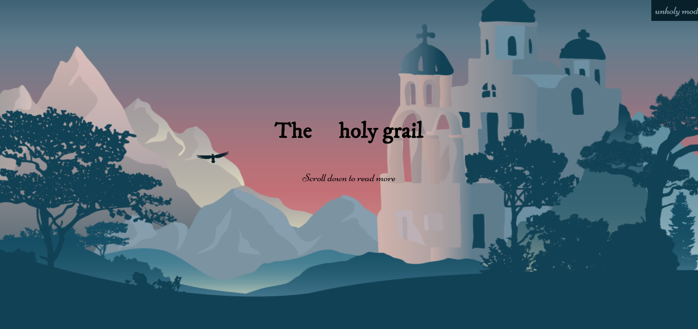
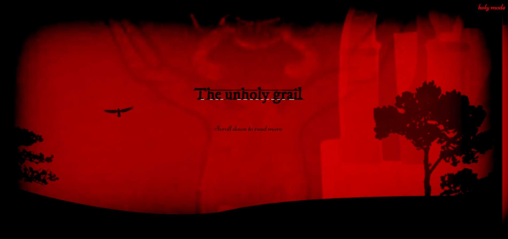

# CSS to the Rescue @cmda-minor-web 18-19

# Summary
A magazine article layout which features a holy mode and unholy mode.
The holy mode is nice and peaceful while the unholy mode introduces.



# Live demo
https://follywolly.github.io/css-to-the-rescue-1819/src/

# Table of contents
1. [Assignment](#assignment)
2. [Methodology](#methodology)
3. [Restrictions](#restrictions)

[License](#license)

# Assignment
_Magazine Layout with dark mode/light mode_

I implemented a holy and unholy mode since it works well with the theme of the article.



# Methodology
_BEM_

BEM is a way of structuring your css selectors.
It works as follows:

**B** lock (block)   
**E** lement (block__element)    
**M** odifier (block__element--modifier)  

Let's take a block as example: a card .
In your HTML it looks like this:
```html
<article class="card"> <!-- block -->
   <!-- element -->
  <div class="card__content"> <!-- element -->
    <h3 class="card__title">Some title</h3> <!-- element -->
    <p class="card__text">A small paragraph</p>
    <p class="card__text card__text--bolder">A small paragraph, but bolder</p> <!--element with modifier -->
  </div>
</article>
```
As you can see, subchildren of block children don't take the class of their parent as a prefix: the block is the only prefix you get. So, no nested class names.

```css
.card { /* block */
  margin: 1rem;
}
.card__content { /* parent element */
  padding: 1rem;
}
.card__text { /* child element */
  font-weight: normal;
  font-size: 1rem;
  color: white;
}
.card__text--bolder { /* modifier */
  font-weight: bolder;
}
```

Or more concise in SCCS, like this:
```scss
.card { //block
  margin: 1rem;
  &__content { // parent element
    padding: 1rem;
  }
  &__text { // child element
    font-weight: normal;
    font-size: 1rem;
    color: white;
    &--bolder { // modifier
      font-weight: bolder;
    }
  }
}
```

# Restrictions
- _Two colors_
- _Responsive without media queries_

## Two colors
I used white and lightblue as the two main colors:
when you switch to dark mode you get red and black.

## Responsive without media queries
The site is fully functional on mobile.

# License
[MIT](LICENSE) @ [Folkert-Jan van der Pol](https://github.com/follywolly)
